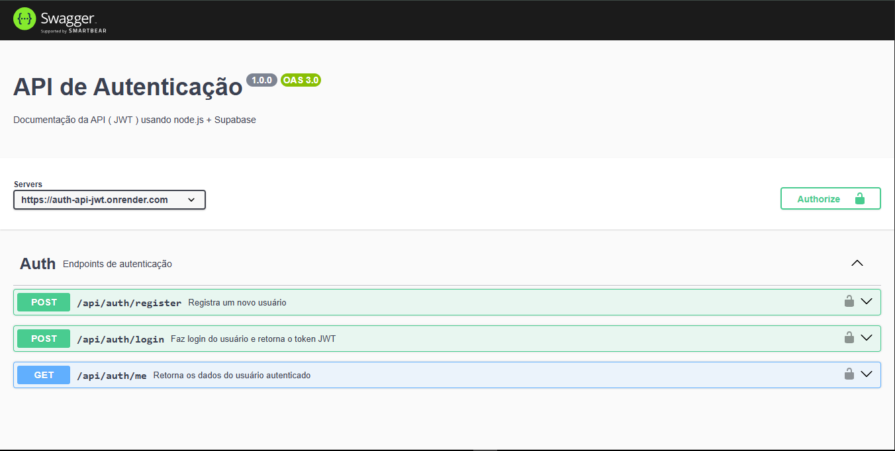

<h1 align="center">Welcome to auth-api 👋</h1>
<p>
  <a href="https://www.npmjs.com/package/auth-api" target="_blank">
    
  </a>
  <a href="#" target="_blank">
    
  </a>
</p>

> A robust authentication API using JWT, Express, and Supabase, designed to provide secure and scalable endpoints for user registration, login, and management in modern applications.

## Long Description

**auth-api** is a complete authentication solution for user management, built with Node.js, Express, and Supabase. It provides RESTful endpoints for user registration, login, and retrieval of authenticated user information, using JWT for authentication and bcrypt for password security. This API is ideal for projects that require fast, secure, and easy-to-integrate authentication.

Key features:
- User registration with validation and password hashing
- Login with JWT token generation
- Authentication middleware to protect private routes
- Integration with Supabase for data persistence
- Automatic documentation with Swagger

## Preview

<p align="center">
  
</p>

## Installation

```sh
npm install
```

## Usage Guide

### 1. Environment Setup

Create a `.env` file in the root directory with the following variables:

```
PORT=5000
JWT_SECRET=your_secret_key
SUPABASE_URL=your_supabase_url
SUPABASE_KEY=your_supabase_key
```

### 2. Start the Server

```sh
npm run dev
```

The server will be available at `http://localhost:5000`.

### 3. API Documentation

Access the interactive documentation at:  
[http://localhost:5000/api-docs](http://localhost:5000/api-docs)

### 4. Main Endpoints

#### Register User

- **POST** `/api/auth/register`
- Request body:
  ```json
  {
    "email": "user@email.com",
    "password": "secure_password",
    "name": "User Name"
  }
  ```
- Response: `201 Created` on success.

#### Login

- **POST** `/api/auth/login`
- Request body:
  ```json
  {
    "email": "user@email.com",
    "password": "secure_password"
  }
  ```
- Response:
  ```json
  {
    "token": "jwt_token"
  }
  ```

#### Get Authenticated User Data

- **GET** `/api/auth/me`
- Header: `Authorization: Bearer <token>`
- Response:
  ```json
  {
    "id": "uuid",
    "name": "User Name",
    "email": "user@email.com"
  }
  ```

## Technologies Used

- Node.js
- Express
- Supabase
- JWT (jsonwebtoken)
- bcryptjs
- Swagger

## Author

👤 **João**

* Website: joao tambue
* Github: [@joao-tambue](https://github.com/joao-tambue)
* LinkedIn: [@João Tambue](https://linkedin.com/in/João Tambue)

## Show your support

Give a ⭐️ if this project helped you!

***
_This README was generated with ❤️